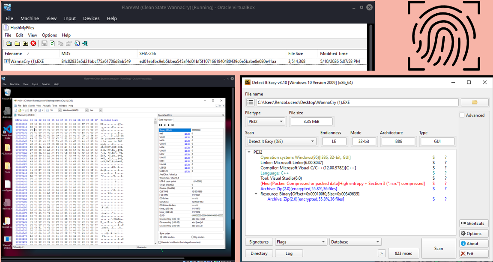
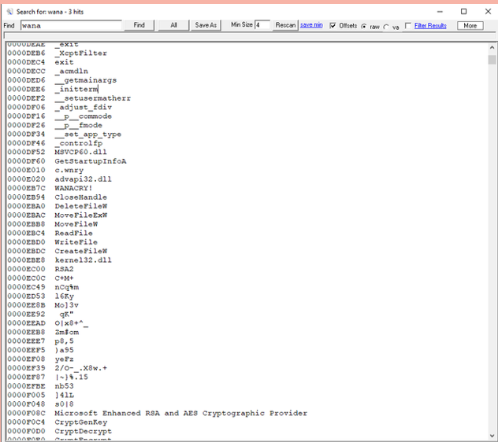
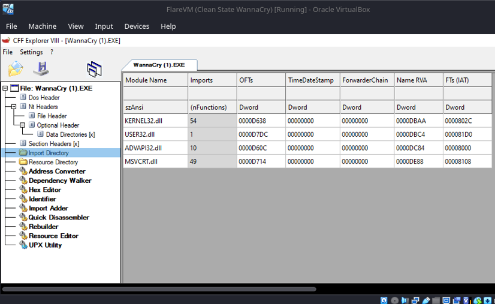

# Sample 01 — Static Analysis of WannaCry Executable

**Binary:** WannaCry.exe  
**Jenis Analisis:** Static Analysis  
**Platform:** Microsoft Windows  
**Format Binary:** Portable Executable (PE)  
**Status:** Completed

---

# Pendahuluan

Dokumentasi ini berisi hasil **Static Analysis** terhadap binary **WannaCry.exe** sebagai bagian dari praktikum Reverse Engineering. Analisis dilakukan tanpa menjalankan executable sehingga seluruh informasi diperoleh melalui observasi terhadap struktur internal file Portable Executable (PE).

Melalui proses ini dapat diperoleh berbagai informasi penting seperti struktur executable, hash file, section, strings, import function, hingga karakteristik dasar binary sebelum dilakukan analisis yang lebih mendalam.

---

# Tujuan Analisis

Analisis ini bertujuan untuk:

- Mengidentifikasi karakteristik dasar executable.
- Memahami struktur Portable Executable (PE).
- Mengidentifikasi library Windows yang digunakan.
- Menganalisis strings yang tersimpan di dalam binary.
- Mendokumentasikan hasil analisis secara sistematis.

---

# Tools

Tools yang digunakan selama proses analisis:

- Detect It Easy (DIE)
- PEStudio
- Ghidra
- IDA Free
- HxD
- CertUtil

---

# 1. Triage

Tahap triage dilakukan untuk memperoleh informasi awal mengenai executable sebelum memasuki proses analisis yang lebih mendalam.

| Atribut | Nilai |
|---------|-------|
| Nama File | WannaCry.exe |
| Format | PE32 / PE32+ |
| Arsitektur | x86 / x64 |
| Operating System | Microsoft Windows |
| Compiler | Microsoft Visual C/C++ |
| Packer | Packed / Compressed (.rsrc) |

Hasil identifikasi menunjukkan bahwa binary menggunakan format **Portable Executable (PE)** yang merupakan format standar executable pada sistem operasi Windows.

---

# 2. Hash Analysis

Hash digunakan sebagai identitas unik executable sehingga memudahkan proses identifikasi maupun pencarian informasi pada berbagai database malware.

| Algoritma | Nilai |
|-----------|-------|
| MD5 | `84c82835a5d21bbcf75a61706d8ab549` |
| SHA-256 | `ed01ebfbc9eb5bbea545af4d01bf5f1071661840480439c6e5babe8e080e41aa` |

Hash tersebut juga berguna untuk memastikan integritas file selama proses analisis.

---

# 3. PE Header Analysis

PE Header merupakan bagian penting dalam executable yang menyimpan informasi mengenai struktur dasar file.

| Parameter | Hasil |
|-----------|-------|
| File Format | Portable Executable (PE) |
| Entry Point | PE32 Executable Entry Point |
| Image Base | PE32 Windows Executable |
| Architecture | x86 / x64 |
| Number of Sections | `.text`, `.data`, `.rdata`, `.rsrc` |

Dari hasil analisis dapat diketahui bahwa executable masih menggunakan struktur PE standar Windows. Informasi tersebut memberikan gambaran bagaimana sistem operasi akan memuat executable ke dalam memori sebelum dieksekusi.

## Hasil Analisis



---

# 4. Section Analysis

Executable terdiri atas beberapa section yang memiliki fungsi berbeda selama proses eksekusi.

| Section | Fungsi |
|---------|--------|
| `.text` | Menyimpan instruksi machine code |
| `.data` | Menyimpan data yang dapat berubah |
| `.rdata` | Menyimpan data read-only |
| `.rsrc` | Menyimpan resource executable |

Berdasarkan hasil observasi, executable menggunakan struktur section standar yang umum ditemukan pada aplikasi Windows. Informasi ini membantu memahami bagaimana kode program dan data disusun di dalam binary.

---

# 5. Strings Analysis

Strings Analysis dilakukan untuk menemukan informasi tekstual yang tersimpan di dalam executable.

Beberapa string yang berhasil ditemukan antara lain:

```text
.doc
.docx
.xls
.xlsx
.pdf
.jpg
.zip
.wnry
CreateFile
WriteFile
MoveFile
RegSetValueExA
```

Keberadaan berbagai ekstensi dokumen menunjukkan bahwa executable memiliki keterkaitan dengan proses manipulasi file. Selain itu ditemukan beberapa nama Windows API yang berhubungan dengan operasi file dan registry.

## Hasil Analisis



---

# 6. Import Function Analysis

Import Table menunjukkan library Windows yang digunakan oleh executable.

| DLL | Fungsi |
|-----|--------|
| KERNEL32.dll | Operasi dasar sistem |
| USER32.dll | Antarmuka pengguna |
| ADVAPI32.dll | Registry & Security API |
| MSVCRT.dll | Microsoft C Runtime |

Library tersebut menunjukkan bahwa executable memanfaatkan Windows API untuk menjalankan berbagai operasi sistem seperti manipulasi file, pengelolaan registry, dan fungsi runtime.

## Hasil Analisis



---

# 7. Indicators of Compromise (IOC)

| Jenis | Nilai |
|-------|-------|
| File Name | tasksche.exe |
| MD5 | 84c82835a5d21bbcf75a61706d8ab549 |
| SHA-256 | ed01ebfbc9eb5bbea545af4d01bf5f1071661840480439c6e5babe8e080e41aa |
| Compiler | Microsoft Visual C/C++ |
| Packer | Packed / Compressed |

IOC dapat digunakan sebagai identitas digital executable sehingga memudahkan proses identifikasi maupun korelasi dengan hasil analisis lainnya.

---

# 8. Ringkasan Analisis

Hasil Static Analysis menunjukkan bahwa:

- Binary menggunakan format Portable Executable (PE).
- Memiliki struktur section standar Windows.
- Menggunakan beberapa Windows API melalui Import Table.
- Ditemukan sejumlah strings yang memberikan gambaran mengenai karakteristik executable.
- Analisis dilakukan sepenuhnya tanpa menjalankan binary.

---

# 9. Kesimpulan

Static Analysis merupakan langkah awal yang penting dalam proses Reverse Engineering karena mampu memberikan banyak informasi tanpa harus mengeksekusi executable. Melalui analisis terhadap PE Header, Section, Strings, Import Function, serta Hash File, diperoleh gambaran mengenai struktur internal executable dan karakteristik dasar binary.

Informasi tersebut dapat dijadikan dasar untuk proses analisis lanjutan seperti Dynamic Analysis, Debugging, maupun Malware Analysis.

---

# Disclaimer

Repository ini dibuat untuk tujuan edukasi sebagai bagian dari pembelajaran mata kuliah **Reverse Engineering**.

Binary asli tidak disertakan di dalam repository. Seluruh dokumentasi hanya berisi hasil observasi dan analisis yang dilakukan pada lingkungan laboratorium/virtual machine untuk kepentingan pembelajaran keamanan siber.
