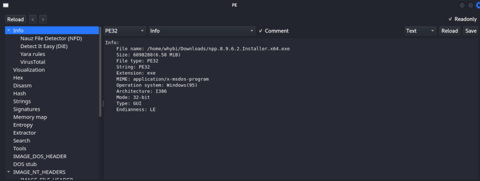
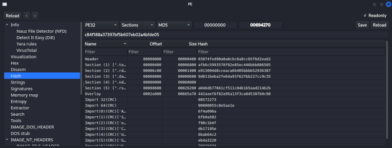
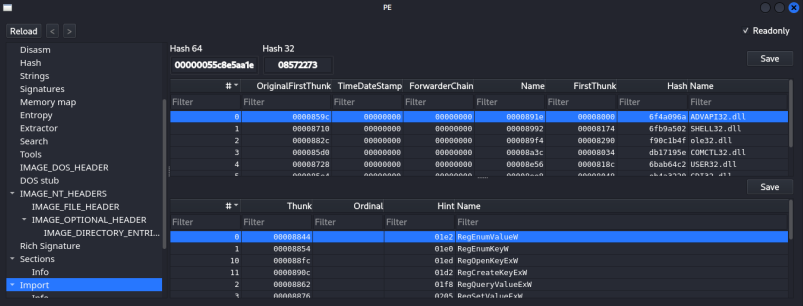
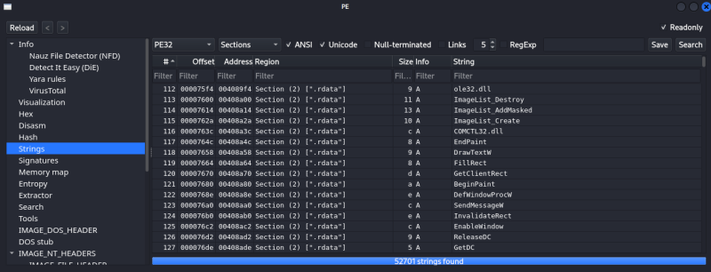

# Sample 02 — Static Analysis of Notepad++ Installer

**Sample:** npp.8.9.6.2.Installer.x64.exe  
**Analysis Type:** Static Analysis  
**Operating System:** Microsoft Windows  
**Format:** Portable Executable (PE32)  
**Analysis Date:** _(Sesuaikan dengan tanggal analisis)_

---

# 📖 Pendahuluan

Dokumen ini berisi hasil analisis statis terhadap file installer **Notepad++ v8.9.6.2 x64** menggunakan metode **Static Analysis**. Analisis dilakukan tanpa menjalankan executable sehingga seluruh informasi diperoleh melalui pemeriksaan struktur file menggunakan tools Reverse Engineering.

Tujuan analisis ini adalah mengidentifikasi karakteristik dasar executable, memahami struktur Portable Executable (PE), mengamati library yang digunakan, serta memperoleh informasi awal yang dapat membantu proses Reverse Engineering.

---

# 📌 Informasi File

| Atribut | Nilai |
|---------|-------|
| Nama File | npp.8.9.6.2.Installer.x64.exe |
| Format | PE32 |
| Operating System | Microsoft Windows |
| Arsitektur | x86 |
| Tipe Aplikasi | GUI |
| Compiler | Microsoft Visual C/C++ |
| Linker | Microsoft Linker 6.0 |
| Installer | NSIS (Nullsoft Scriptable Install System) |
| Overlay | NSIS Data |

---

# 🛠 Tools yang Digunakan

Selama proses analisis, beberapa tools berikut digunakan untuk memperoleh informasi mengenai executable.

- Detect It Easy (DIE)
- Linux Terminal
- Windows PE Viewer

---

# 🔍 1. PE Header Analysis

Tahap pertama dilakukan dengan mengidentifikasi informasi dasar executable menggunakan Detect It Easy.

Berdasarkan hasil analisis, file menggunakan format **Portable Executable (PE32)** yang merupakan format standar executable pada sistem operasi Windows. Binary dikompilasi menggunakan **Microsoft Visual C/C++** dan memanfaatkan **NSIS (Nullsoft Scriptable Install System)** sebagai installer.

Informasi ini memberikan gambaran awal mengenai bagaimana executable dibangun sebelum dilakukan analisis lebih lanjut.

| Parameter | Hasil |
|-----------|-------|
| Format | PE32 |
| Operating System | Microsoft Windows |
| Architecture | x86 |
| Compiler | Microsoft Visual C/C++ |
| Linker | Microsoft Linker 6.0 |
| Installer | NSIS |



---

# 🔑 2. Hash Analysis

Hash merupakan identitas unik dari sebuah file executable. Nilai hash sering digunakan untuk proses identifikasi maupun verifikasi integritas file.

Hasil perhitungan hash menunjukkan nilai berikut.

| Algoritma | Nilai |
|-----------|-------|
| MD5 | `c84f188a37397bf5b607eb02a4bfde05` |

Nilai tersebut dapat digunakan untuk memastikan bahwa file yang dianalisis sesuai dengan file yang digunakan selama proses praktikum.



---

# 📚 3. Import Function Analysis

Import Table menunjukkan library Windows yang digunakan oleh executable untuk menjalankan berbagai fungsi sistem.

Beberapa library yang berhasil diidentifikasi antara lain:

| DLL | Keterangan |
|-----|------------|
| ADVAPI32.dll | Registry dan Security API |
| SHELL32.dll | Operasi Shell Windows |
| ole32.dll | COM Library |
| COMCTL32.dll | Windows Common Controls |
| USER32.dll | Antarmuka Pengguna |

Berdasarkan hasil analisis, executable memanfaatkan beberapa Windows API untuk mendukung proses instalasi serta interaksi dengan sistem operasi Windows.



---

# 📝 4. Strings Analysis

Strings Analysis dilakukan untuk menemukan informasi tekstual yang tersimpan di dalam executable.

Beberapa string yang berhasil ditemukan antara lain:

```text
ole32.dll
ImageList_Destroy
ImageList_DrawMasked
ImageList_Create
COMCTL32.dll
DrawTextW
FillRect
GetClientRect
BeginPaint
DefWindowProcW
```

Sebagian besar string yang ditemukan berkaitan dengan komponen antarmuka pengguna (GUI) Windows serta library sistem yang digunakan selama proses instalasi aplikasi.

Informasi ini dapat dimanfaatkan sebagai petunjuk awal untuk memahami karakteristik executable tanpa perlu menjalankannya.



---

# 📊 Ringkasan Hasil Analisis

Berdasarkan proses Static Analysis yang telah dilakukan, diperoleh beberapa informasi penting sebagai berikut.

- Binary menggunakan format **Portable Executable (PE32)**.
- Target executable adalah sistem operasi Microsoft Windows.
- Installer dibuat menggunakan **NSIS (Nullsoft Scriptable Install System)**.
- Binary dikompilasi menggunakan **Microsoft Visual C/C++**.
- Ditemukan beberapa Windows API melalui Import Table.
- Strings menunjukkan keberadaan berbagai fungsi GUI dan library sistem.
- Seluruh analisis dilakukan tanpa menjalankan executable.

---

# 📝 Kesimpulan

Static Analysis merupakan langkah awal yang penting dalam proses Reverse Engineering karena memungkinkan analis memperoleh informasi mengenai struktur internal executable tanpa perlu mengeksekusi program.

Melalui analisis terhadap PE Header, Hash, Import Function, dan Strings, diperoleh gambaran mengenai karakteristik file installer Notepad++, termasuk format executable, compiler yang digunakan, mekanisme instalasi, serta library sistem yang dimanfaatkan. Informasi tersebut dapat dijadikan dasar untuk menentukan proses analisis lanjutan apabila diperlukan.

---

# 📄 Disclaimer

Dokumen ini dibuat untuk tujuan edukasi sebagai bagian dari pembelajaran mata kuliah Reverse Engineering.

Seluruh informasi yang disajikan merupakan hasil observasi menggunakan tools analisis statis terhadap installer Notepad++. Repository ini tidak menyertakan file executable, source code, maupun hasil dekompilasi secara utuh. Seluruh penjelasan ditulis berdasarkan hasil analisis pribadi dan digunakan hanya untuk keperluan pembelajaran.

---

# 📚 Referensi

- Microsoft Portable Executable (PE) Format Specification
- Detect It Easy (DIE) Documentation
- Notepad++ Official Website
